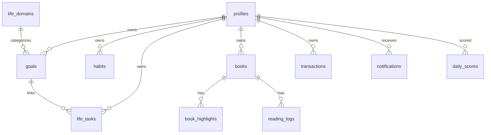

# LifeOS Pro — Database Guide

**Engine:** PostgreSQL 15 (Supabase)  
**Project ref:** `zxwsbjrqggjpqhtwjvby`  
**Security:** Row Level Security (RLS) on all user tables

> This guide is the operator-facing database reference. See also `DATABASE_SCHEMA.md` for the same schema inventory.

---

## Design Principles

1. **Relational first** — each entity type has its own table with `user_id` FK to `profiles`.
2. **Life domains** — goals, habits, tasks, and logs link to `life_domains` for scoring and navigation.
3. **Goal hierarchy** — `goals.level`: `vision` → `goal` → `project`; `parent_id` self-reference.
4. **Legacy compatibility** — `legacy_id` columns and `domain_category_mappings` support LifeOS v1 import.
5. **Deprecated store** — `life_years.payload` retained but emptied (migration 007); not used for reads/writes.

---

## Migration List (run in order)

| # | File | Summary |
|---|------|---------|
| 001 | `001_initial_schema.sql` | Base tables, RLS, `handle_new_user` trigger |
| 002 | `002_profiles_insert_policy.sql` | `profiles_insert_own` policy |
| 003 | `003_archive_preferences.sql` | Snapshots, summaries, preferences |
| 004 | `004_lifeos_v1_fields.sql` | Nutrition targets on profiles |
| 005 | `005_lifeos_pro_schema.sql` | Full Pro schema, domains, entities, career, scoring |
| 006 | `006_storage_buckets.sql` | progress-photos, book-covers |
| 007 | `007_relational_completion.sql` | Learning tables; deprecate payload |
| 008 | `008_account_profile.sql` | Avatar, timezone, language, avatars bucket |
| 009 | `009_v1_completion.sql` | RBAC, book highlights, activity log, AI config, book-media |
| 010 | `010_performance_hardening.sql` | Query indexes, privacy settings comment |

**Apply migrations:**

```bash
# Set SUPABASE_DB_URL in .env, then:
npm run migrate
```

Or paste each file in order into **Supabase → SQL Editor**.

**Post-migration admin setup:**

```sql
UPDATE profiles SET role = 'admin' WHERE id = '<your-user-uuid>';
```

---

## Storage Buckets

| Bucket | Public | Max size | MIME types |
|--------|--------|----------|------------|
| `progress-photos` | No | 10 MB | jpeg, png, webp, gif |
| `book-covers` | No | 5 MB | jpeg, png, webp |
| `avatars` | Yes | 2 MB | jpeg, png, webp |
| `book-media` | Yes | 50 MB | images, pdf, epub |

All buckets enforce **user-folder isolation**: `auth.uid() = folder[1]`.

Book covers use **signed URLs** (1h expiry) via `/api/books`.

---

## Performance Indexes (010)

| Index | Purpose |
|-------|---------|
| `idx_profiles_last_active` | Admin user activity sorting |
| `idx_life_tasks_user_status_due` | Task list filters by status/due |
| `idx_goals_user_status` | Goal dashboard queries |
| `idx_books_user_status_type` | Books gallery filters |
| `idx_habit_logs_user_date` | Today's habits lookup |

---

## RLS Summary

- **Default:** `auth.uid() = user_id` on all user-owned rows.
- **Profiles:** users read/update own; admins read all profiles (009).
- **Activity log:** users insert own; admins select all.
- **Reference tables:** `life_domains` system rows readable by all authenticated users.
- **Storage:** folder-based ownership per bucket policies.

---

## Key Tables by Domain

| Domain | Tables |
|--------|--------|
| Auth & Account | `profiles`, `user_preferences` |
| Productivity | `goals`, `habits`, `habit_logs`, `life_tasks` |
| Body | `weight_logs`, `body_measurements`, `progress_photos`, `workouts`, `workout_set_logs` |
| Nutrition | `foods`, `meal_logs` |
| Books | `books`, `reading_logs`, `book_highlights` |
| Finance | `transactions`, `debts`, `budgets` |
| Career | `career_profiles`, `career_milestones`, `certifications`, `skills`, … |
| Learning | `learning_paths`, `study_sessions`, `knowledge_areas` |
| System | `notifications`, `daily_scores`, `activity_log`, `ai_provider_config` |
| Archive | `yearly_snapshots`, `yearly_summaries` |

Full table inventory: `DATABASE_SCHEMA.md`.

---

## Entity Relationship (simplified)



---

## Troubleshooting

| Symptom | Fix |
|---------|-----|
| `relation does not exist` | Run pending migrations 005–010 |
| RLS blocks insert | Verify `user_id = auth.uid()` in payload |
| Avatar upload fails | Confirm `avatars` bucket + policies (008) |
| Book cover 403 | Check `book-covers` bucket; path must be `{userId}/{bookId}.ext` |
| Admin panel empty | Set `profiles.role = 'admin'` |

---

## Backup Reference

See `BACKUP_AND_RECOVERY.md` for export, import, and disaster recovery.
