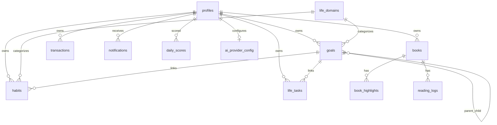

# LifeOS Pro — Database Schema

**Engine:** PostgreSQL 15 (Supabase)  
**Project ref:** `zxwsbjrqggjpqhtwjvby`  
**Security:** Row Level Security (RLS) on all user tables

---

## Design Principles

1. **Relational first** — each entity type has its own table with `user_id` FK to `profiles`.
2. **Life domains** — goals, habits, tasks, and logs link to `life_domains` for scoring and navigation.
3. **Goal hierarchy** — `goals.level`: `vision` → `goal` → `project`; `parent_id` self-reference.
4. **Legacy compatibility** — `legacy_id` columns and `domain_category_mappings` support LifeOS v1 import.
5. **Deprecated store** — `life_years.payload` retained but emptied (migration 007); not used for reads/writes.

---

## Core Tables (001)

| Table | Purpose |
|-------|---------|
| `profiles` | User profile; extends `auth.users` |
| `life_years` | Year scope marker; `payload` deprecated |
| `goals` | Goals with area, priority, dates, progress |
| `habits` | Habit definitions |
| `habit_logs` | Daily habit completion |
| `weight_logs` | Weight / sleep / calories entries |
| `workouts` | Workout sessions (legacy `sets` JSONB) |
| `meals` | Legacy meal entries (superseded by `meal_logs` in 005) |

---

## Archive & Preferences (003)

| Table | Purpose |
|-------|---------|
| `yearly_snapshots` | Frozen year JSON archives |
| `yearly_summaries` | Computed cross-year metrics |
| `user_preferences` | Theme, notifications, app settings |

---

## LifeOS Pro Schema (005)

### Reference

| Table | Purpose |
|-------|---------|
| `life_domains` | 8 system domains (body, finance, career, …) + user custom |
| `time_horizons` | life_vision, 3y, annual, quarterly, monthly |
| `entity_types` | Metadata registry for entity kinds |
| `domain_category_mappings` | Legacy v1 category → domain_id |

### Productivity

| Table | Purpose |
|-------|---------|
| `life_tasks` | GTD-style tasks (inbox/active/done/archive) |
| `goals` | Extended: domain_id, parent_id, level, status, metadata |

### Body & Fitness

| Table | Purpose |
|-------|---------|
| `body_measurements` | Circumference / body fat measurements |
| `progress_photos` | Progress photo metadata + storage path |
| `exercises` | Exercise catalog per user |
| `workout_set_logs` | Per-set training logs |
| `weight_logs` | Extended with domain_id, metadata |

### Nutrition

| Table | Purpose |
|-------|---------|
| `foods` | Food catalog |
| `meal_logs` | Meals with macros |

### Books

| Table | Purpose |
|-------|---------|
| `books` | Reading library |
| `reading_logs` | Pages / minutes read |

### Finance

| Table | Purpose |
|-------|---------|
| `transactions` | Income / expense / saving |
| `debts` | Debt tracking |
| `budgets` | Monthly category budgets |

### Reviews & Journals

| Table | Purpose |
|-------|---------|
| `daily_journals` | Daily journal entries |
| `weekly_reviews` | Weekly review records |
| `monthly_reviews` | Monthly review records |

### System

| Table | Purpose |
|-------|---------|
| `notifications` | In-app notifications |
| `daily_scores` | Domain + life scores per day |
| `score_weights` | User-customizable score weights |
| `dashboard_snapshots` | Cached dashboard state |
| `activity_log` | User/admin audit events |

### Career Hub

| Table | Purpose |
|-------|---------|
| `career_profiles` | Career profile summary |
| `career_milestones` | Roadmap stages |
| `certifications` | Certifications |
| `courses` | Courses |
| `skills` | Skills with proficiency |
| `portfolio_projects` | Portfolio items |
| `job_applications` | Job applications |
| `interviews` | Interview records |
| `networking_contacts` | Network contacts |
| `mentors` | Mentor relationships |

### AI (stubs in 005, config in 009)

| Table | Purpose |
|-------|---------|
| `insights` | Stored AI insights |
| `goal_forecasts` | Goal forecast data |
| `coach_sessions` | Coach conversation sessions |
| `ai_provider_config` | Per-user provider selection (009) |

---

## Relational Completion (007)

| Table | Purpose |
|-------|---------|
| `learning_paths` | Structured learning paths |
| `study_sessions` | Study session logs |
| `knowledge_areas` | Knowledge area progress |
| `period_reviews` | Quarterly / annual reviews |

---

## Account & V1 Completion (008–009)

### 008 — Account profile

- `profiles`: `avatar_url`, `timezone`, `language`, `bio`
- Storage bucket: `avatars`

### 009 — RBAC, books, audit, AI

- `profiles`: `role`, `suspended`, `last_active_at`
- `books`: `book_type`, `tags`, `highlights`, `media_path`
- `book_highlights` — per-highlight notes
- `activity_log` — admin-readable audit (redefined with UUID id)
- `ai_provider_config` — mock | openai | anthropic
- Storage bucket: `book-media`
- Unique index: `daily_scores (user_id, score_date)`

---

## Storage Buckets (006, 008, 009)

| Bucket | Public | Max size | MIME types |
|--------|--------|----------|------------|
| `progress-photos` | No | 10 MB | jpeg, png, webp, gif |
| `book-covers` | No | 5 MB | jpeg, png, webp |
| `avatars` | Yes | 2 MB | jpeg, png, webp |
| `book-media` | Yes | 50 MB | images, pdf, epub |

All buckets enforce **user-folder isolation**: `auth.uid() = folder[1]`.

---

## Entity Relationship (simplified)



---

## Migration List

| # | File | Summary |
|---|------|---------|
| 001 | `001_initial_schema.sql` | Base tables, RLS, `handle_new_user` trigger |
| 002 | `002_profiles_insert_policy.sql` | `profiles_insert_own` policy |
| 003 | `003_archive_preferences.sql` | Snapshots, summaries, preferences |
| 004 | `004_lifeos_v1_fields.sql` | Nutrition targets on profiles |
| 005 | `005_lifeos_pro_schema.sql` | Full Pro schema, domains, entities, career, scoring |
| 006 | `006_storage_buckets.sql` | progress-photos, book-covers |
| 007 | `007_relational_completion.sql` | Learning tables; deprecate payload |
| 008 | `008_account_profile.sql` | Avatar, timezone, language, avatars bucket |
| 009 | `009_v1_completion.sql` | RBAC, book highlights, activity log, AI config, book-media |

**Run migrations:**

```bash
# Set SUPABASE_DB_URL, then:
npm run migrate
```

Or paste each file in order into Supabase SQL Editor.

---

## Indexes & Triggers

- `set_updated_at()` trigger on profiles, goals, habits, learning_paths, etc.
- Partial index `idx_profiles_role` where `role = 'admin'`
- Legacy import: `idx_goals_user_legacy`, similar on habits/weight_logs
- Habit logs: unique `(habit_id, log_date)`

---

## RLS Summary

- **Default:** `auth.uid() = user_id` on all user-owned rows.
- **Profiles:** users read/update own; admins read all profiles (009).
- **Activity log:** users insert own; admins select all.
- **Reference tables:** `life_domains` system rows readable by all authenticated users.
- **Storage:** folder-based ownership per bucket policies.
