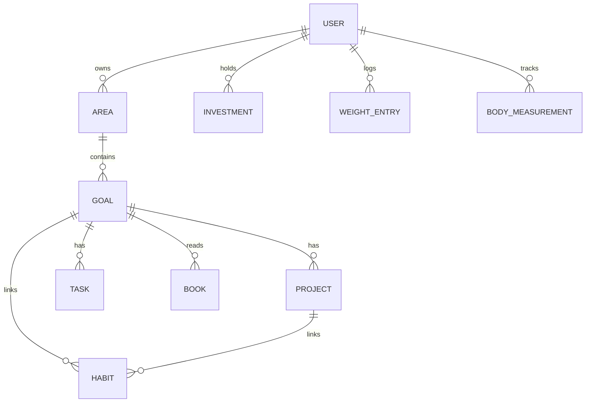

# Entity Relationships — LifeOS Pro

## Core Entities

### User (Profile)
- Owns all domain entities via `user_id`
- Properties: weight, targets, salary, preferences
- Related: all child entities

### Area (Life Domain)
- 8 system domains + custom
- Properties: slug, nameAr, icon, color, healthScore
- Methods: via `AreaHealthEngine`
- Children: Goals, Habits, Tasks, Books (filtered by domain_id)

### Goal
```
GoalEntity
├── id, title, progress, status, level
├── domainId, targetDate
├── habitContributionPct, taskContributionPct, progressContributionPct
├── validate()
├── calculateMetricProgress()
├── calculateProbability()
└── calculateCompletion()
```
- Parent of: Projects (level=project), Tasks, Habits
- Child of: Area (domainId)

### Project
```
ProjectEntity
├── id, title, progress, goalId
```
- Special case: Goal with `level = "project"`
- Parent goal via `parentId` / `goalId`

### Task
```
TaskEntity
├── id, title, status, priority, dueDate, goalId
├── isOverdue(today)
└── isDone()
```
- Belongs to: Goal, Area
- Triggers: `TaskCompleted` event

### Habit
```
HabitEntity
├── id, name, activeDays, impact, lifeScoreWeight
├── currentStreak(logs)
├── longestStreak(logs)
├── adherence(logs, days)
└── score(logs)
```
- Belongs to: Goal, Project, Area
- Triggers: `HabitCompleted` event

### Book
```
BookEntity
├── id, title, progress, status
└── isFinished()
```

### Investment
```
InvestmentEntity
├── id, name, costBasis, currentValue
├── calculateROI()
└── gain()
```
- Triggers: `InvestmentAdded` event

### BodyMeasurement
```
BodyMeasurementEntity
├── chest, arm, waist, thigh, calf, heightCm
├── validate()
└── calculateBMI(weightKg)
```

### WeightEntry
```
WeightEntryEntity
├── weight, logDate
├── validate()
└── progressTowardTarget(current, target, start)
```
- Triggers: `WeightUpdated` event

## Relationship Diagram



## Event → Analytics Flow

```
HabitCompleted  ──┐
TaskCompleted   ──┤
GoalUpdated     ──┼──► EventBus ──► AnalyticsHandlers ──► Cache invalidation
WeightUpdated   ──┤
BookFinished    ──┤
InvestmentAdded ──┘
```

## Type Alignment

| Domain Entity | Legacy Type (`types/`) |
|---------------|------------------------|
| GoalEntity | `Goal` in `lifeos.ts` |
| HabitEntity | `Habit` in `lifeos.ts` |
| TaskEntity | `life_tasks` rows |
| AreaHubPayload | `areas.ts` (DTO, not entity) |
| WealthSnapshot | `wealth.ts` (read model) |

Domain entities wrap and enrich legacy types without breaking existing DTOs.
