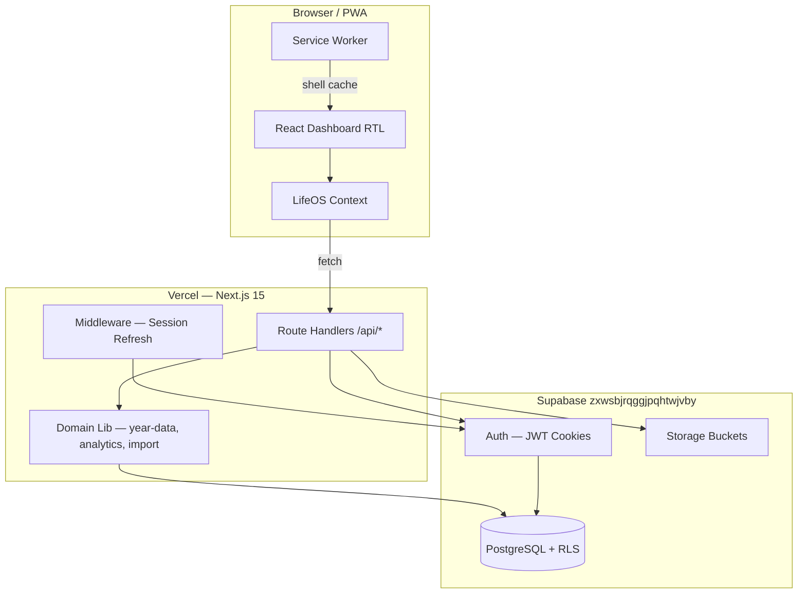

# LifeOS Pro — System Architecture

**Version:** 1.0.0  
**Production:** https://lifeoss-nine.vercel.app  
**Repository:** https://github.com/mohamedaliaboulfath1-ship-it/lifeoss.git  
**Backend:** Supabase (`zxwsbjrqggjpqhtwjvby`) — PostgreSQL, Auth, Storage

---

## Overview

LifeOS Pro is a personal life-operating-system SaaS built on **Next.js 15 App Router** with a **relational PostgreSQL** data model. The UI is Arabic-first (RTL) with bilingual domain labels. All user data lives in normalized Supabase tables — `life_years.payload` is **deprecated** and no longer the primary store.

---

## Architectural Layers

| Layer | Technology | Responsibility |
|-------|------------|----------------|
| **Presentation** | React 19, Tailwind CSS 4, Framer Motion | Dashboard views, RTL UI, PWA shell |
| **Client state** | `LifeOSContext`, `ThemeContext` | Cached year data, optimistic UI |
| **API (BFF)** | Next.js Route Handlers (`src/app/api/`) | Auth gate, validation (Zod), orchestration |
| **Domain logic** | `src/lib/` | Year aggregation, analytics, import/export, AI |
| **Data** | Supabase PostgreSQL + RLS | Relational entities per life domain |
| **Auth** | Supabase Auth (SSR cookies) | Session via `@supabase/ssr` |
| **Storage** | Supabase Storage buckets | Avatars, book covers, progress photos, book media |
| **Deploy** | Vercel | Edge middleware, serverless API routes |

---

## Frontend / Backend Split

### Frontend (Client Components)

- **Routes:** `src/app/(dashboard)/*` — dashboard, habits, goals, finance, career, admin, account, etc.
- **Auth pages:** `src/app/(auth)/login`, `register`, `forgot-password`, `reset-password`
- **Providers:** `AppProviders` wraps theme, toast, and LifeOS context
- **PWA:** `manifest.json` + `sw.js` (network-first shell cache; API requests bypass SW)

### Backend (Server)

- **API routes:** Entity CRUD, v1 analytics/search/export, admin RBAC
- **Middleware:** `src/middleware.ts` → `updateSession()` refreshes Supabase cookies, redirects unauthenticated users
- **Server Supabase client:** `src/lib/supabase/server.ts` — used in API routes and RSC
- **Data aggregation:** `getYearForUser()` / `getUserContext()` in `src/lib/year-data.ts` joins relational tables into a `YearPayload` for the UI

### Key data flow

1. User authenticates → Supabase sets session cookies.
2. Dashboard loads → `LifeOSContext` fetches `GET /api/data` (full user context).
3. Entity mutations → dedicated routes (`/api/tasks`, `/api/habits`, etc.) write to relational tables.
4. Reads for legacy views → `loadRelationalYearData()` maps DB rows → `YearPayload`.
5. Analytics → `GET /api/v1/analytics` computes scores and upserts `daily_scores`.

---

## Relational Architecture

Pre-V1 data was stored in `life_years.payload` (JSONB). Migration **005** introduced domain-scoped tables (`life_tasks`, `books`, `transactions`, `meal_logs`, etc.). Migration **007** completed learning hub tables and **emptied** remaining payload data.

```
profiles (1) ──┬── goals, habits, life_tasks
               ├── body: weight_logs, body_measurements, progress_photos
               ├── fitness: workouts, workout_set_logs, exercises
               ├── nutrition: meal_logs, foods
               ├── finance: transactions, debts, budgets
               ├── books + reading_logs + book_highlights
               ├── career: job_applications, interviews, certifications, …
               ├── learning: study_sessions, learning_paths, knowledge_areas
               └── meta: notifications, daily_scores, activity_log
```

Reference tables (`life_domains`, `time_horizons`, `entity_types`) are shared; system domains are seeded with `user_id = null`.

---

## AI Layer

- **Provider abstraction:** `src/lib/ai/provider.ts`
- **Active:** `mock` — rule-based insights via `buildAiInsights()`
- **Ready for activation:** `openai`, `anthropic` — require `OPENAI_API_KEY` / `ANTHROPIC_API_KEY` on Vercel and `ai_provider_config.enabled = true`
- **Endpoints:** `/api/v1/ai/insights`, `/api/v1/ai/brief`, `/api/v1/ai/coach`

---

## Admin & RBAC

- `profiles.role`: `user` | `admin` (migration 009)
- `requireAdmin()` in `src/lib/api-auth.ts` guards `/api/admin`
- Admin UI at `/admin/*` — client-side gate via API 403 check
- `activity_log` — audit trail; admins can read all entries via RLS

---

## Architecture Diagram



---

## Directory Map (high level)

```
src/
  app/
    (auth)/          # Login, register, password reset
    (dashboard)/     # Feature pages + admin + account
    api/             # REST-style route handlers
  components/        # UI, dashboard views, layout
  contexts/          # LifeOS, theme, toast
  lib/
    supabase/        # Client, server, middleware helpers
    analytics/       # Score engine
    ai/              # Provider + engine
    import/          # LifeOS v1 backup importer
    export/          # PDF / Excel builders
supabase/migrations/ # 001–009 SQL migrations
public/              # manifest.json, sw.js, icons
```

---

## Environment Variables

| Variable | Required | Purpose |
|----------|----------|---------|
| `NEXT_PUBLIC_SUPABASE_URL` | Yes | Supabase project URL |
| `NEXT_PUBLIC_SUPABASE_ANON_KEY` | Yes | Public anon key (RLS-enforced) |
| `SUPABASE_DB_URL` | Migrate only | Direct Postgres for `npm run migrate` |
| `OPENAI_API_KEY` | Optional | Activate OpenAI provider |
| `ANTHROPIC_API_KEY` | Optional | Activate Anthropic provider |

See `.env.example` for templates.
